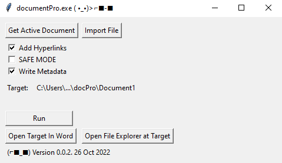

# docPro

*A Word Document postprocessor to improve quality and efficiency.*

Last Modified: 06 Dec 2022, Daniel Evans

## Introduction

Install the application as a package using 

```pip install -e docpro```

Commands:

- `docproapp` (GUI)
- `docpro` (CLI)

## Images


